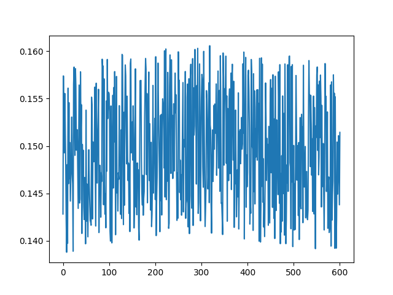
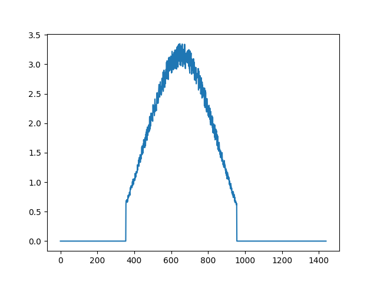
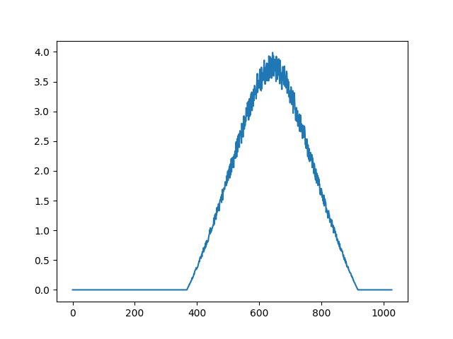
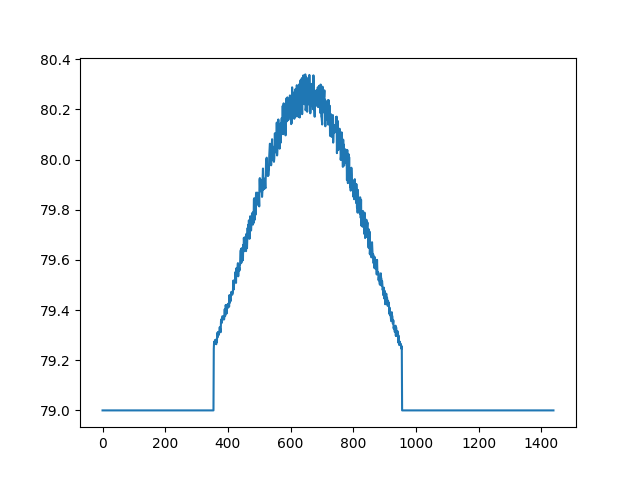
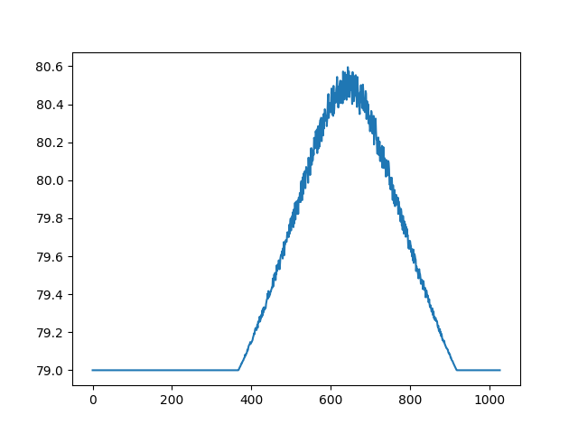

# TIR
## Uruchamianie
1. Uruchomić server.py
2. Uruchomić device.py
3. W celu obejrzenia wykresów z zebranych statystyk uruchomić plik diagrams.py

Aby połączyć urządzenie z serwerem, należy kliknąć przycisk na urządzeniu.
Do jednego serwera można podłączyć wiele urządzeń, 
każdy uruchomiony skrypt device.py imituje jedno urządzenie.

## Pliki:
- sunposition.py - serwis zwracajacy dane na temat słońca. Kąt padania promieni dla danych współrzędnych geograficznych i daty.
- Panel.py - klasa pojedynczego panelu słonecznego. Zawiera:
  - metodę calculate_g która służy do obliczenia aktualne natężenia promieni słonecznych padających na panel, jako parametry przyjmuje położenie paneli oraz w którą strone są obrócone i jak nachylone, oraz czas w strefie UTC0 domyślnie przyjmowany jako aktualny czas 
  - metodę get_power_stats która wylicza aktualne parametry produkowanej energii
  - metodę calculate_data która jako argument może przyjąć czas i przy pomocy powyższych metod wylicza *I, V, G* które razem z aktualnym czasem i powierzchnią panelu zwraca jako dictionary
- device.py - Symulacja realnego urządzenia obsługującego panel, przy pomocy client.py przesyła dane do serwera.

Komunikacja pomiędzy serwerem, a klientem odbywa się przy użyciu protokołu MQTT.

- server.py - Server odbierający dane od paneli i umieszczająca je w bazie danych.
- client.py - Klasa, której używa urządzenie (device) do łączenia się z serwerem.
- diagrams.py - Skrypt rysujący diagramy z danych. 

## Wykres przedstawiający wydajność panelu w ciągu dnia, pomijane są pomiary przy których parametr *G* równy *0*

### na poniższych wykresach możemy zaobserwować różnicę statystyk prądu dla dnia 14.02 oraz dnia 22.06
jak widać skutecznie symulowane są różnice w zależności od położenia słońca
## Wykres natężenie w dniu 14.02.2021

## Wykres natężenia w dniu 22.06.2020

## Wykres napięcia w dniu 14.02.2021

## Wykres napięcia w dniu 22.06.2020
